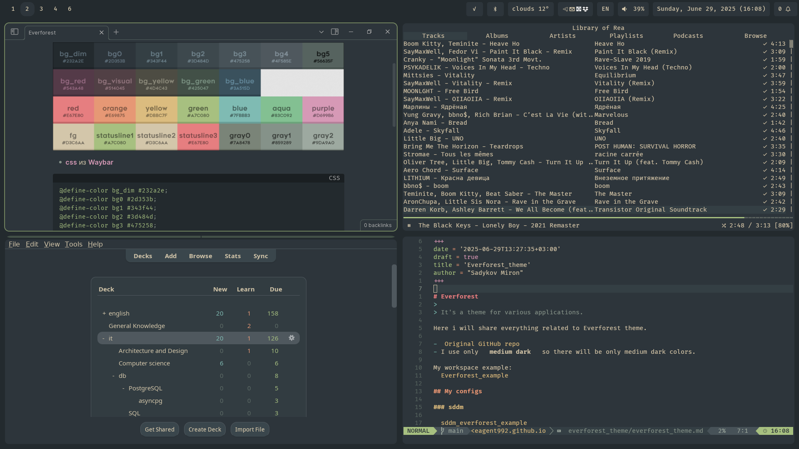
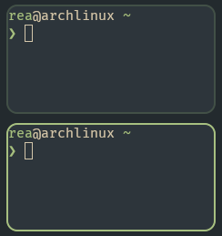
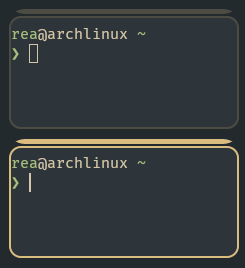
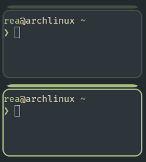
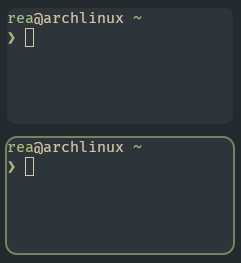
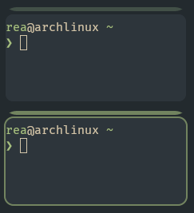
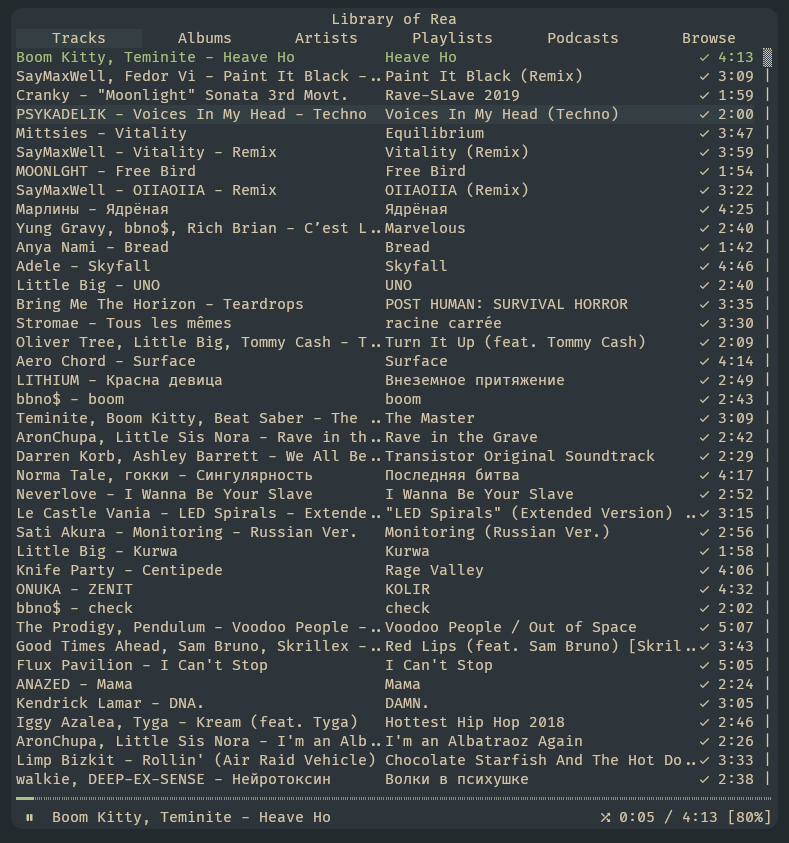

+++
date = '2025-06-29T13:27:35+03:00'
draft = false
title = 'Everforest_theme'
author = "Sadykov Miron"
toc = true
description = 'How i use everforest theme'
+++

>
> It's a theme for various applications.

Here i will share everything related to Everforest theme.

- [Original GitHub repo](https://github.com/sainnhe/everforest)
- I use only **medium dark** so there will be only medium dark colors.

My workspace example:


## My configs

### sddm


### lockscreen

#### waylock
>
> it'a simple one color screen-locker

```
waylock -init-color 0x232A2E -input-color 0x2D353B -fail-color 0x543A48 -input-alt-color 0x232A2E -ignore-empty-password -fork-on-lock
```

### hyprland

- bar on top of window is a group, and yellow is a locked group
- i use #232a2e as background(wallpaper) color

```ini
misc {
    background_color = 0x232A2E
}
```

#### default everforest





```ini
general {
    col.active_border = rgba(167,192,128,1)
    col.inactive_border = rgba(66,80,71,1)
}
group {
    col.border_active = rgba(167,192,128,1)
    col.border_inactive = rgba(66,80,71,1)
    col.border_locked_active = rgba(219,188,127,1)
    col.border_locked_inactive = rgba(77,76,67,1)
    groupbar {
      text_color = rgba(211,198,170,1)
      col.active = rgba(167,192,128,1)
      col.inactive = rgba(66,80,71,1)
      col.locked_active = rgba(219,188,127,1)
      col.locked_inactive = rgba(77,76,67,1)
    }
}
```

#### my flavor

I found defult everforest too bright for me here, so i dim it little bit and turn off inactive border due to i use matched backround(wallpaper) color.





```ini
general {
    col.active_border = rgba(167,192,128,0.6)
    col.inactive_border = rgba(66,80,71,0)
}
group {
    col.border_active = rgba(167,192,128,0.6)
    col.border_inactive = rgba(66,80,71,0)
    col.border_locked_active = rgba(219,188,127,0.6)
    col.border_locked_inactive = rgba(77,76,67,0)
    groupbar {
      text_color = rgba(211,198,170,1)
      col.active = rgba(167,192,128,0.6)
      col.inactive = rgba(66,80,71,1)
      col.locked_active = rgba(219,188,127,0.6)
      col.locked_inactive = rgba(77,76,67,1)
    }
}

```

### ncspot
>
> it's a spotify TUI player.
>

- [ncspot github](https://github.com/hrkfdn/ncspot)



Config file path: `~/.config/ncspot/config.toml`

```toml
[theme]
background = "#2D353B"
primary = "#D3C6AA"
secondary = "#D3C6AA"
title = "#D3C6AA"
playing = "#A7C080"
playing_selected = "#A7C080"
playing_bg = "#2D353B"
highlight = "#D3C6AA"
highlight_bg = "#343F44"
error = "#E67E80"
error_bg = "#514045"
statusbar = "#D3C6AA"
statusbar_progress = "#A7C080"
statusbar_bg = "#2D353B"
cmdline = "#2D353B"
cmdline_bg = "#D3C6AA"
```

### Waybar
>
> It's a bar on side of screen that display time/date, language, volume, etc.

- [waybar github](https://github.com/Alexays/Waybar)

```css
/* https://github.com/Alexays/Waybar/wiki/Styling */
/* Everforest medium-dark color scheme */
@define-color bg_dim #232a2e;
@define-color bg0 #2d353b;
@define-color bg1 #343f44;
@define-color bg2 #3d484d;
@define-color bg3 #475258;
@define-color bg4 #4f585e;
@define-color bg5 #56635f;
@define-color bg_visual #543a48;
@define-color bg_red #514045;
@define-color bg_green #425047;
@define-color bg_blue #3a515d;
@define-color bg_yellow #4d4c43;
@define-color fg #d3c6aa;
@define-color red #e67e80;
@define-color orange #e69875;
@define-color yellow #dbbc7f;
@define-color green #a7c080;
@define-color aqua #83c092;
@define-color blue #7fbbb3;
@define-color purple #d699b6;
@define-color grey0 #7a8478;
@define-color grey1 #859289;
@define-color grey2 #9da9a0;
@define-color statusline1 #a7c080;
@define-color statusline2 #d3c6aa;
@define-color statusline3 #e67e80;


* {
  font-family: "FiraCode Nerd Font";
  font-size: 14px;
  font-weight: 500;
  color: @fg;
}

#waybar {
  background: @bg_dim;
}

/* basic style for all modules */
/* add all your custom modules here */
#workspaces, #clock, #battery, #pulseaudio, #network, #language, #backlight, #tray, #custom-power, #custom-date, #cpu, #memory, #disk, #temperature, #custom-weather, #custom-docker, #bluetooth, #custom-docker-micro, #privacy, #systemd-failed-units, #custom-notifications, #custom-swaync {
  background-color: @bg0;
  padding: 0px 10px 0px;
  margin: 5px;
  border-radius: 5px;
  min-width: 20px;
}

#workspaces {
  background-color: @bg_dim;
}

#workspaces button {
  color: @fg;
  background: transparent;
}

#workspaces button.active {
  background: @bg0;
}

/* blink animation */
@keyframes urgent-blink {
  0% {
    background-color: @red;
  }

  50% {
    background-color: transparent;
  }

  100% {
    background-color: @red;
  }
}

#workspaces button.urgent {
  animation: urgent-blink 2s infinite;
  color: @statusline3;
}
```

## Community links

### Obsidian

i use [Obsidian Everforest Enchanted - github](https://github.com/FireIsGood/obsidian-everforest-enchanted/tree/main)
but it use Everforest dark sort, so i change it littel bit to fir Everforest dark medium.
file: `.obsidian/themes/Everforest Enchanted/theme.css`

```css
/** Dark Theme (medium) **/
:root .theme-dark {
    --bg-dim-rgb: 35, 42, 46;
    --bg-dim: #232a2e;
    --bg0: #2d353b;
    --bg1: #343f44;
    --bg2: #3d484d;
    --bg3: #475258;
    --bg4: #4f585e;
    --bg5: #56635f;

    --bg-visual: #543a48;
    --bg-red: #514045;
    --bg-green: #425047;
    --bg-blue: #3a515d;
    --bg-yellow: #4d4c43;

    --fg: #d3c6aa;

    --fg-red: #e67e80;
    --fg-orange: #e69875;
    --fg-yellow: #dbbc7f;
    --fg-green: #a7c080;
    --fg-aqua: #83c092;
    --fg-blue: #7fbbb3;
    --fg-purple: #d699b6;

    --header-red: #e67e80;
    --header-orange: #e69875;
    --header-yellow: #dbbc7f;
    --header-green: #a7c080;
    --header-aqua: #83c092;
    --header-blue: #7fbbb3;
    --header-purple: #d699b6;

    --grey0: #7a8478;
    --grey1: #859289;
    --grey2: #9da9a0;

    --statusline0: #a7c080;
    --statusline1: #d3c6aa;
    --statusline2: #e67e80;

    --bg0-rgb: 45, 53, 59;
    --background-embed-transparent: rgba(62, 75, 80, 0.7);
    --tag-color-hsl: 254, 80%, 68%;
}
```

### swaync

### ANKI

### Firefox and Betterbird
>
> Betterbird is a Thunderbird fork with improvements for Linux.
