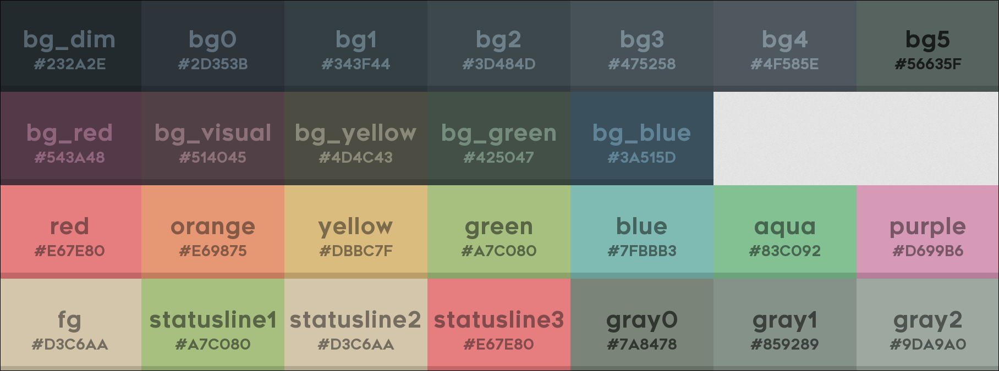
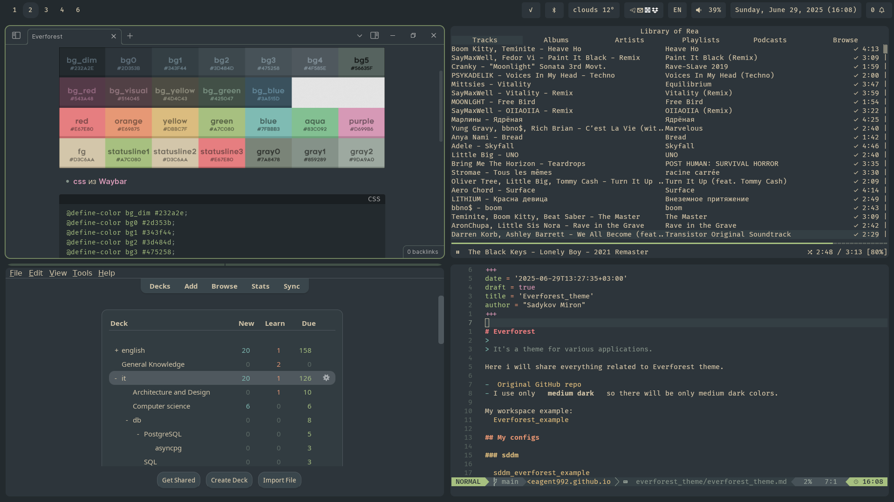
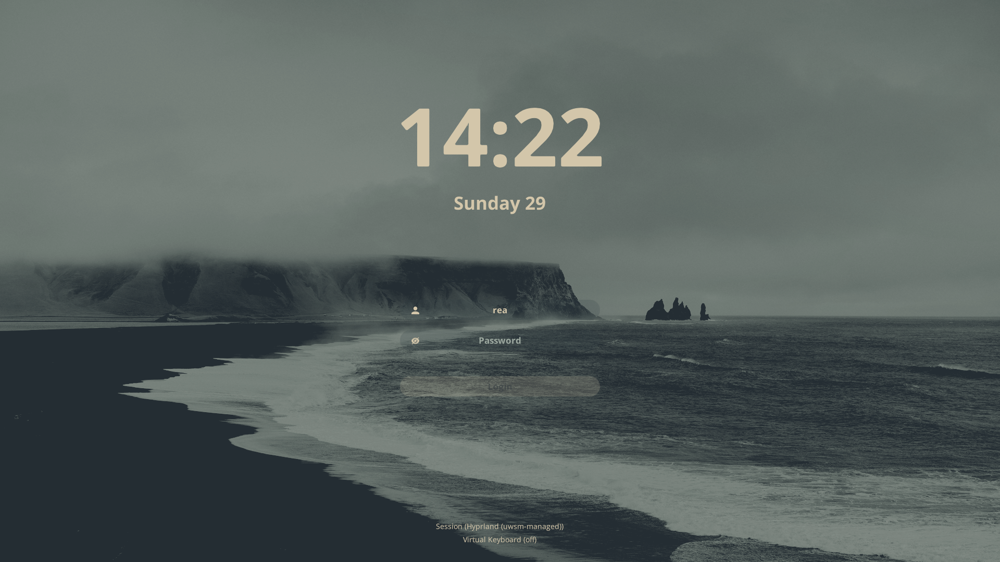
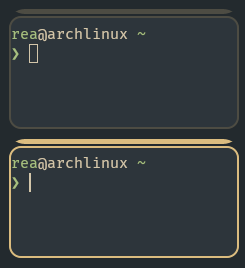
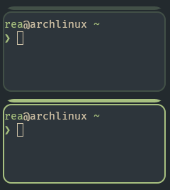
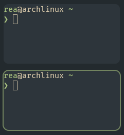
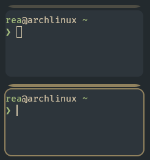
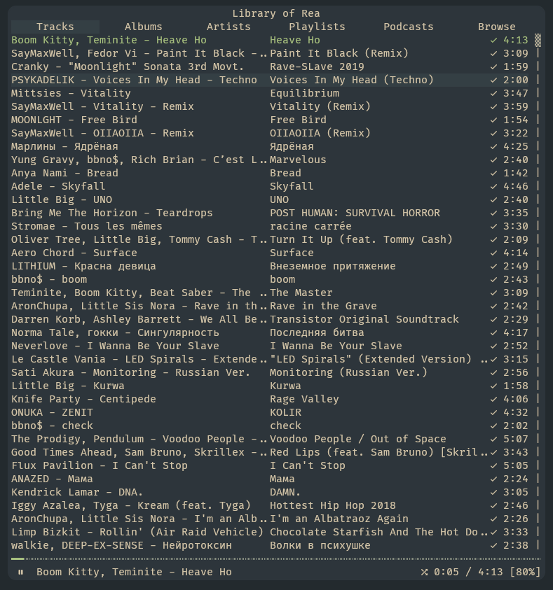
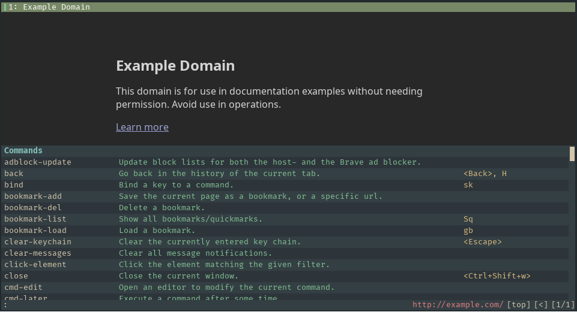

+++
date = '2025-06-29T13:27:35+03:00'
draft = false
title = 'Everforest'
author = "Sadykov Miron"
toc = true
description = 'How I use the Everforest theme'
keywords = ["Everforest", "everforest theme", "everforest hyprland", "everforest ncspot", "everforest waybar", "everforest waylock"]
+++

> It's a color scheme for various applications.

- [Original Everforest GitHub repo](https://github.com/sainnhe/everforest)

## palette

- I use only **medium dark** so there will be only medium dark colors.



```
bg_dim #232a2e;
bg0 #2d353b;
bg1 #343f44;
bg2 #3d484d;
bg3 #475258;
bg4 #4f585e;
bg5 #56635f;
bg_visual #543a48;
bg_red #514045;
bg_green #425047;
bg_blue #3a515d;
bg_yellow #4d4c43;
fg #d3c6aa;
red #e67e80;
orange #e69875;
yellow #dbbc7f;
green #a7c080;
aqua #83c092;
blue #7fbbb3;
purple #d699b6;
grey0 #7a8478;
grey1 #859289;
grey2 #9da9a0;
statusline1 #a7c080;
statusline2 #d3c6aa;
statusline3 #e67e80;
```

## My configs

- My main font is: [FiraCode](https://github.com/tonsky/FiraCode) with [nerd font icons](https://www.nerdfonts.com/font-downloads)
- One thing I don't like in Everforest is the bright green. I prefer to dim it a little bit.

My workspace example:


<!-- ### sddm -->
<!---->
<!--  -->

### lockscreen

#### waylock

> it's a simple one-color screen locker.

```
waylock -init-color 0x232A2E -input-color 0x2D353B -fail-color 0x543A48 -input-alt-color 0x232A2E -ignore-empty-password -fork-on-lock
```

<!-- #### hyprlock -->
<!---->
<!-- TODO: -->

### hyprland

```ini
$bg_dim = rgb(232a2e)
$bg0 = rgb(2d353b)
$bg1 = rgb(343f44)
$bg2 = rgb(3d484d)
$bg3 = rgb(475258)
$bg4 = rgb(4f585e)
$bg5 = rgb(56635f)
$bg_visual = rgb(543a48)
$bg_red = rgb(514045)
$bg_green = rgb(425047)
$bg_blue = rgb(3a515d)
$bg_yellow = rgb(4d4c43)
$fg = rgb(d3c6aa)
$red = rgb(e67e80)
$orange = rgb(e69875)
$yellow = rgb(dbbc7f)
$yellow_quiet = rgba(219,188,127,0.6)
$green = rgb(a7c080)
$green_quiet = rgba(167,192,128,0.6)
$aqua = rgb(83c092)
$blue = rgb(7fbbb3)
$purple = rgb(d699b6)
$grey0 = rgb(7a8478)
$grey1 = rgb(859289)
$grey2 = rgb(9da9a0)
$statusline1 = rgb(a7c080)
$statusline2 = rgb(d3c6aa)
$statusline3 = rgb(e67e80)

```

- Bar on top of window is a group, and yellow is a locked group
- I use `#232a2e` as the background (wallpaper) color. It's bg_dim.

```ini
misc {
    background_color = $bg_dim
}
```

#### default everforest





```ini
general {
    col.active_border = $green
    col.inactive_border = $bg_green
}
group {
    col.border_active = $green
    col.border_inactive = $bg_green
    col.border_locked_active = $yellow
    col.border_locked_inactive = $bg_yellow
    groupbar {
      text_color = $fg
      col.active = $green
      col.inactive = $bg_green
      col.locked_active = $yellow
      col.locked_inactive = $bg_yellow
    }
}
```

#### my flavor

I found the default Everforest too bright for me. so i dim it little bit and turn off inactive border due to i use matched backround(wallpaper) color.





```ini
general {
    col.active_border = $green_quiet
    col.inactive_border = $bg_dim
}
group {
    col.border_active = $green_quiet
    col.border_inactive = $bg_dim
    col.border_locked_active = $yellow_quiet
    col.border_locked_inactive = $bg_dim
    groupbar {
      text_color = $fg
      col.active = $green_quiet
      col.inactive = $bg_green
      col.locked_active = $yellow_quiet
      col.locked_inactive = $bg_yellow
    }
}

```

### ncspot

> It's a Spotify TUI player.

- [ncspot github](https://github.com/hrkfdn/ncspot)



Config file path: `~/.config/ncspot/config.toml`

```toml
[theme]
background = "#2D353B"
primary = "#D3C6AA"
secondary = "#D3C6AA"
title = "#D3C6AA"
playing = "#A7C080"
playing_selected = "#A7C080"
playing_bg = "#2D353B"
highlight = "#D3C6AA"
highlight_bg = "#343F44"
error = "#E67E80"
error_bg = "#514045"
statusbar = "#D3C6AA"
statusbar_progress = "#A7C080"
statusbar_bg = "#2D353B"
cmdline = "#2D353B"
cmdline_bg = "#D3C6AA"
```

### Waybar

> It's a bar on the side of the screen that displays the time/date, language, volume, etc.

- [waybar github](https://github.com/Alexays/Waybar)

```css
/* https://github.com/Alexays/Waybar/wiki/Styling */
/* Everforest medium-dark color scheme */
@define-color bg_dim #232a2e;
@define-color bg0 #2d353b;
@define-color bg1 #343f44;
@define-color bg2 #3d484d;
@define-color bg3 #475258;
@define-color bg4 #4f585e;
@define-color bg5 #56635f;
@define-color bg_visual #543a48;
@define-color bg_red #514045;
@define-color bg_green #425047;
@define-color bg_blue #3a515d;
@define-color bg_yellow #4d4c43;
@define-color fg #d3c6aa;
@define-color red #e67e80;
@define-color orange #e69875;
@define-color yellow #dbbc7f;
@define-color green #a7c080;
@define-color aqua #83c092;
@define-color blue #7fbbb3;
@define-color purple #d699b6;
@define-color grey0 #7a8478;
@define-color grey1 #859289;
@define-color grey2 #9da9a0;
@define-color statusline1 #a7c080;
@define-color statusline2 #d3c6aa;
@define-color statusline3 #e67e80;

* {
  font-family: "FiraCode Nerd Font";
  font-size: 14px;
  font-weight: 500;
  color: @fg;
}

#waybar {
  background: @bg_dim;
}

/* basic style for all modules */
/* add all your custom modules here */
#workspaces,
#clock,
#battery,
#pulseaudio,
#network,
#language,
#backlight,
#tray,
#custom-power,
#custom-date,
#cpu,
#memory,
#disk,
#temperature,
#custom-weather,
#custom-docker,
#bluetooth,
#custom-docker-micro,
#privacy,
#systemd-failed-units,
#custom-notifications,
#custom-swaync {
  background-color: @bg0;
  padding: 0px 10px 0px;
  margin: 5px;
  border-radius: 5px;
  min-width: 20px;
}

#workspaces {
  background-color: @bg_dim;
}

#workspaces button {
  color: @fg;
  background: transparent;
}

#workspaces button.active {
  background: @bg0;
}

/* blink animation */
@keyframes urgent-blink {
  0% {
    background-color: @red;
  }

  50% {
    background-color: transparent;
  }

  100% {
    background-color: @red;
  }
}

#workspaces button.urgent {
  animation: urgent-blink 2s infinite;
  color: @statusline3;
}
```

### qutebrowser



```python
# config.py
from qutebrowser.config.config import ConfigContainer
from qutebrowser.config.configfiles import ConfigAPI

config: ConfigAPI = config  # noqa: F821  # pyright: ignore[reportUndefinedVariable]
c: ConfigContainer = c  # noqa: F821  # pyright: ignore[reportUndefinedVariable]

## ---------------------------
## UI and Theme
## ---------------------------
config.source("everforest.py")
c.fonts.default_family = "FiraCode Nerd Font"
```

```python
# everforest.py
from qutebrowser.config.config import ConfigContainer
from qutebrowser.config.configfiles import ConfigAPI

config: ConfigAPI = config  # noqa: F821  # pyright: ignore[reportUndefinedVariable]
c: ConfigContainer = c  # noqa: F821  # pyright: ignore[reportUndefinedVariable]

### -------------------
### Color palette
### -------------------
fg = "#d3c6aa"
red = "#e67e80"
orange = "#e69875"
yellow = "#dbbc7f"
green = "#a7c080"
# I prefer slightly shaded green.
# green = "rgba(167, 192, 128, 0.6)"
aqua = "#83c092"
blue = "#7fbbb3"
purple = "#d699b6"
grey0 = "#7a8478"
grey1 = "#859289"
grey2 = "#9da9a0"
statusline1 = "#a7c080"
statusline2 = "#d3c6aa"
statusline3 = "#e67e80"
bg_dim = "#232a2e"
bg0 = "#2d353b"
bg1 = "#343f44"
bg2 = "#3d484d"
bg3 = "#475258"
bg4 = "#4f585e"
bg5 = "#56635f"
bg_visual = "#543a48"
bg_red = "#514045"
bg_green = "#425047"
bg_blue = "#3a515d"
bg_yellow = "#4d4c43"

### -----------------------------------------------------------
### Theme
### -----------------------------------------------------------

### Completion aka Command line

# Text color of the completion widget. May be a single color to use for
# all columns or a list of three colors, one for each column.
c.colors.completion.fg = [fg, aqua, yellow]

# Background color of the completion widget for odd rows.
c.colors.completion.odd.bg = bg0

# Background color of the completion widget for even rows.
# c.colors.completion.even.bg = c.colors.completion.odd.bg
c.colors.completion.even.bg = bg1

# Foreground color of completion widget category headers.
c.colors.completion.category.fg = blue

# Background color of the completion widget category headers.
c.colors.completion.category.bg = bg1

# Top border color of the completion widget category headers.
c.colors.completion.category.border.top = c.colors.completion.category.bg

# Bottom border color of the completion widget category headers.
c.colors.completion.category.border.bottom = c.colors.completion.category.bg

# Foreground color of the selected completion item.
c.colors.completion.item.selected.fg = fg

# Background color of the selected completion item.
c.colors.completion.item.selected.bg = bg4  # bg4

# Top border color of the selected completion item.
c.colors.completion.item.selected.border.top = bg2

# Bottom border color of the selected completion item.
c.colors.completion.item.selected.border.bottom = (
    c.colors.completion.item.selected.border.top
)

# Foreground color of the matched text in the selected completion item.
c.colors.completion.item.selected.match.fg = orange

# Foreground color of the matched text in the completion.
c.colors.completion.match.fg = c.colors.completion.item.selected.match.fg

# Color of the scrollbar handle in the completion view.
c.colors.completion.scrollbar.fg = c.colors.completion.item.selected.fg

# Color of the scrollbar in the completion view.
c.colors.completion.scrollbar.bg = c.colors.completion.category.bg


### Context menu

# Background color of disabled items in the context menu.
c.colors.contextmenu.disabled.bg = bg3

# Foreground color of disabled items in the context menu.
c.colors.contextmenu.disabled.fg = grey1

# Background color of the context menu. If set to null, the Qt default is used.
c.colors.contextmenu.menu.bg = bg0

# Foreground color of the context menu. If set to null, the Qt default is used.
c.colors.contextmenu.menu.fg = fg

# Background color of the context menu’s selected item. If set to null, the Qt default is used.
c.colors.contextmenu.selected.bg = bg2

# Foreground color of the context menu’s selected item. If set to null, the Qt default is used.
c.colors.contextmenu.selected.fg = c.colors.contextmenu.menu.fg

### Downloads

# Background color for the download bar.
c.colors.downloads.bar.bg = bg0

# Color gradient start for download text.
c.colors.downloads.start.fg = bg0

# Color gradient start for download backgrounds.
c.colors.downloads.start.bg = blue

# Color gradient end for download text.
c.colors.downloads.stop.fg = c.colors.downloads.start.fg

# Color gradient stop for download backgrounds.
c.colors.downloads.stop.bg = aqua

# Foreground color for downloads with errors.
c.colors.downloads.error.fg = red

# Background color for downloads with errors.
c.colors.downloads.error.bg = bg0

### Hints

# Font color for hints.
c.colors.hints.fg = bg0

# Background color for hints.
c.colors.hints.bg = yellow

# Font color for the matched part of hints.
c.colors.hints.match.fg = bg4

### Keyhint widget

# Text color for the keyhint widget.
c.colors.keyhint.fg = grey2

# Highlight color for keys to complete the current keychain.
c.colors.keyhint.suffix.fg = fg

# Background color of the keyhint widget.
c.colors.keyhint.bg = bg0

### Messages

# Foreground color of an error message.
c.colors.messages.error.fg = bg0

# Background color of an error message.
c.colors.messages.error.bg = red

# Border color of an error message.
c.colors.messages.error.border = c.colors.messages.error.bg

# Foreground color of a warning message.
c.colors.messages.warning.fg = bg0

# Background color of a warning message.
c.colors.messages.warning.bg = purple

# Border color of a warning message.
c.colors.messages.warning.border = c.colors.messages.warning.bg

# Foreground color of an info message.
c.colors.messages.info.fg = fg

# Background color of an info message.
c.colors.messages.info.bg = bg0

# Border color of an info message.
c.colors.messages.info.border = c.colors.messages.info.bg

### Prompts

# Foreground color for prompts.
c.colors.prompts.fg = fg

# Border used around UI elements in prompts.
c.colors.prompts.border = f"1px solid {bg1}"

# Background color for prompts.
c.colors.prompts.bg = bg3

# Background color for the selected item in filename prompts.
c.colors.prompts.selected.bg = bg2

### Statusbar

# Foreground color of the statusbar.
c.colors.statusbar.normal.fg = fg

# Background color of the statusbar.
c.colors.statusbar.normal.bg = bg0

# Foreground color of the statusbar in insert mode.
c.colors.statusbar.insert.fg = bg0

# Background color of the statusbar in insert mode.
c.colors.statusbar.insert.bg = green

# Foreground color of the statusbar in passthrough mode.
c.colors.statusbar.passthrough.fg = bg0

# Background color of the statusbar in passthrough mode.
c.colors.statusbar.passthrough.bg = blue

# Foreground color of the statusbar in private browsing mode.
c.colors.statusbar.private.fg = purple

# Background color of the statusbar in private browsing mode.
c.colors.statusbar.private.bg = bg0

# Foreground color of the statusbar in command mode.
c.colors.statusbar.command.fg = fg

# Background color of the statusbar in command mode.
c.colors.statusbar.command.bg = bg1

# Foreground color of the statusbar in private browsing + command mode.
c.colors.statusbar.command.private.fg = c.colors.statusbar.private.fg

# Background color of the statusbar in private browsing + command mode.
c.colors.statusbar.command.private.bg = c.colors.statusbar.command.bg

# Foreground color of the statusbar in caret mode.
c.colors.statusbar.caret.fg = bg0

# Background color of the statusbar in caret mode.
c.colors.statusbar.caret.bg = purple

# Foreground color of the statusbar in caret mode with a selection.
c.colors.statusbar.caret.selection.fg = c.colors.statusbar.caret.fg

# Background color of the statusbar in caret mode with a selection.
c.colors.statusbar.caret.selection.bg = purple

# Background color of the progress bar.
c.colors.statusbar.progress.bg = blue

# Default foreground color of the URL in the statusbar.
c.colors.statusbar.url.fg = grey2

# Foreground color of the URL in the statusbar on error.
c.colors.statusbar.url.error.fg = red

# Foreground color of the URL in the statusbar for hovered links.
c.colors.statusbar.url.hover.fg = orange

# Foreground color of the URL in the statusbar on successful load
# (http).
c.colors.statusbar.url.success.http.fg = red

# Foreground color of the URL in the statusbar on successful load
# (https).
c.colors.statusbar.url.success.https.fg = fg

# Foreground color of the URL in the statusbar when there's a warning.
c.colors.statusbar.url.warn.fg = purple

### tabs

# Background color of the tab bar.
c.colors.tabs.bar.bg = bg0

# Color gradient start for the tab indicator.
c.colors.tabs.indicator.start = blue

# Color gradient end for the tab indicator.
c.colors.tabs.indicator.stop = aqua

# Color for the tab indicator on errors.
c.colors.tabs.indicator.error = red

# Foreground color of unselected odd tabs.
c.colors.tabs.odd.fg = fg

# Background color of unselected odd tabs.
c.colors.tabs.odd.bg = bg0

# Foreground color of unselected even tabs.
c.colors.tabs.even.fg = c.colors.tabs.odd.fg

# Background color of unselected even tabs.
c.colors.tabs.even.bg = c.colors.tabs.odd.bg

# Foreground color of selected odd tabs.
c.colors.tabs.selected.odd.fg = fg  # before: fg

# Background color of selected odd tabs.
c.colors.tabs.selected.odd.bg = green

# Foreground color of selected even tabs.
c.colors.tabs.selected.even.fg = c.colors.tabs.selected.odd.fg

# Background color of selected even tabs.
c.colors.tabs.selected.even.bg = c.colors.tabs.selected.odd.bg

# Background color of pinned unselected even tabs.
c.colors.tabs.pinned.even.bg = bg0

# Foreground color of pinned unselected even tabs.
c.colors.tabs.pinned.even.fg = fg

# Background color of pinned unselected odd tabs.
c.colors.tabs.pinned.odd.bg = bg0

# Foreground color of pinned unselected odd tabs.
c.colors.tabs.pinned.odd.fg = c.colors.tabs.pinned.even.fg

# Background color of pinned selected even tabs.
c.colors.tabs.pinned.selected.even.bg = c.colors.tabs.selected.odd.bg

# Foreground color of pinned selected even tabs.
c.colors.tabs.pinned.selected.even.fg = c.colors.tabs.selected.odd.fg

# Background color of pinned selected odd tabs.
c.colors.tabs.pinned.selected.odd.bg = c.colors.tabs.selected.odd.bg

# Foreground color of pinned selected odd tabs.
c.colors.tabs.pinned.selected.odd.fg = c.colors.tabs.selected.odd.fg

# Background color for webpages if unset (or empty to use the theme's
# color).
# c.colors.webpage.bg = bg4
```

<!-- ## Community links -->
<!---->
<!-- ### Obsidian -->
<!---->
<!-- i use [Obsidian Everforest Enchanted - github](https://github.com/FireIsGood/obsidian-everforest-enchanted/tree/main) -->
<!-- but it use Everforest dark sort, so i change it littel bit to fit Everforest dark medium. -->
<!-- file: `.obsidian/themes/Everforest Enchanted/theme.css` -->
<!---->
<!-- ```css -->
<!-- /** Dark Theme (medium) **/ -->
<!-- :root .theme-dark { -->
<!--   --bg-dim-rgb: 35, 42, 46; -->
<!--   --bg-dim: #232a2e; -->
<!--   --bg0: #2d353b; -->
<!--   --bg1: #343f44; -->
<!--   --bg2: #3d484d; -->
<!--   --bg3: #475258; -->
<!--   --bg4: #4f585e; -->
<!--   --bg5: #56635f; -->
<!---->
<!--   --bg-visual: #543a48; -->
<!--   --bg-red: #514045; -->
<!--   --bg-green: #425047; -->
<!--   --bg-blue: #3a515d; -->
<!--   --bg-yellow: #4d4c43; -->
<!---->
<!--   --fg: #d3c6aa; -->
<!---->
<!--   --fg-red: #e67e80; -->
<!--   --fg-orange: #e69875; -->
<!--   --fg-yellow: #dbbc7f; -->
<!--   --fg-green: #a7c080; -->
<!--   --fg-aqua: #83c092; -->
<!--   --fg-blue: #7fbbb3; -->
<!--   --fg-purple: #d699b6; -->
<!---->
<!--   --header-red: #e67e80; -->
<!--   --header-orange: #e69875; -->
<!--   --header-yellow: #dbbc7f; -->
<!--   --header-green: #a7c080; -->
<!--   --header-aqua: #83c092; -->
<!--   --header-blue: #7fbbb3; -->
<!--   --header-purple: #d699b6; -->
<!---->
<!--   --grey0: #7a8478; -->
<!--   --grey1: #859289; -->
<!--   --grey2: #9da9a0; -->
<!---->
<!--   --statusline0: #a7c080; -->
<!--   --statusline1: #d3c6aa; -->
<!--   --statusline2: #e67e80; -->
<!---->
<!--   --bg0-rgb: 45, 53, 59; -->
<!--   --background-embed-transparent: rgba(62, 75, 80, 0.7); -->
<!--   --tag-color-hsl: 254, 80%, 68%; -->
<!-- } -->
<!-- ``` -->
<!---->
<!-- ### swaync -->
<!---->
<!-- There is public repo with good everforest css [here](https://github.com/mirzmu/Hyprland-Dots-Ethan/blob/main/.config/swaync/Everforest.css) -->
<!-- But -->
<!---->
<!-- ### ANKI -->
<!---->
<!-- TODO: -->
<!---->
<!-- ### Firefox and Betterbird -->
<!---->
<!-- > Betterbird is a Thunderbird fork with improvements for Linux. -->
<!---->
<!---->
<!-- ### qutebrowser -->
