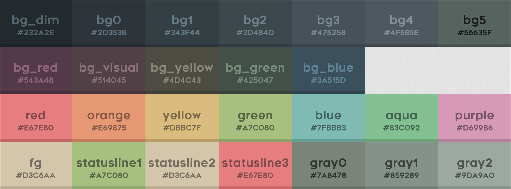
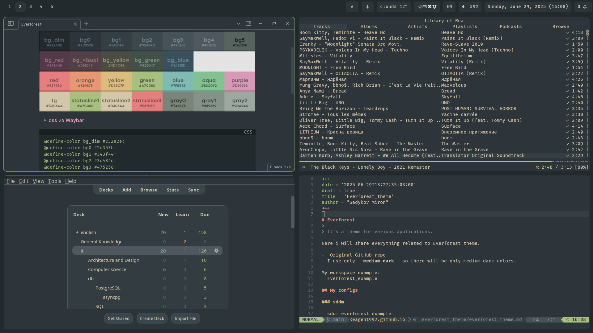
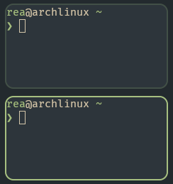
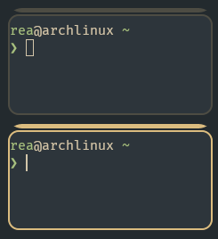
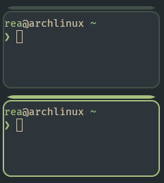
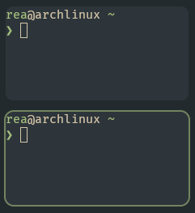
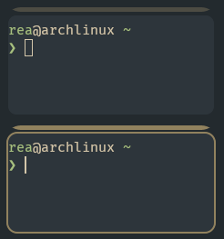
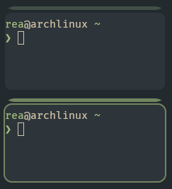
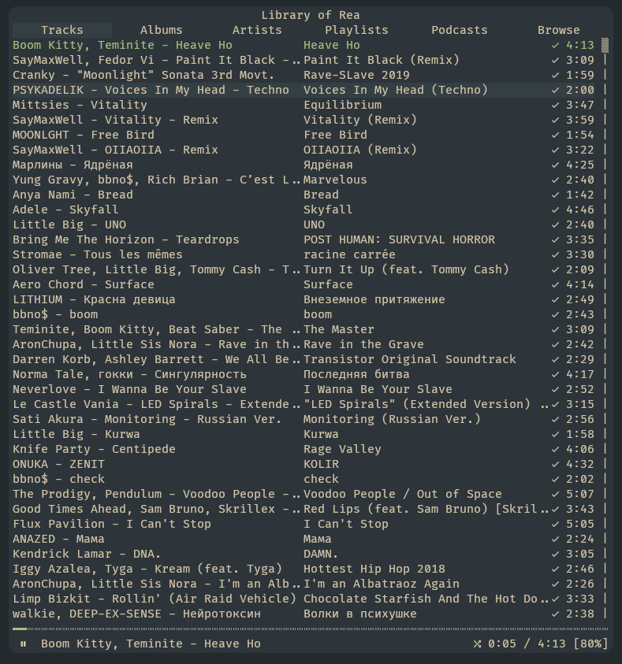
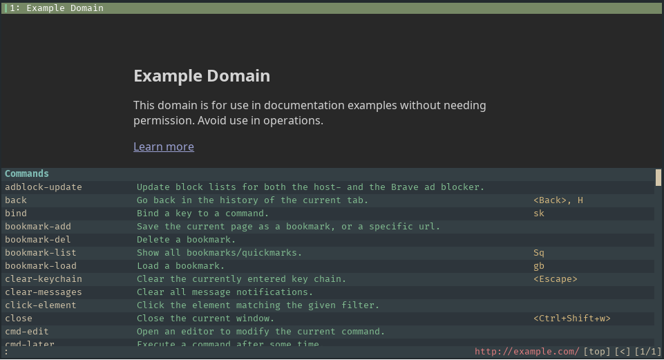

+++
date = '2025-06-29T13:27:35+03:00'
draft = false
title = 'Everforest'
author = "Sadykov Miron"
toc = true
description = 'Как я использую тему Everforest'
keywords = ["Everforest", "everforest theme", "everforest hyprland", "everforest ncspot", "everforest waybar", "everforest waylock"]
+++

> Это цветовая схема для различных приложений.

- [Оригинальный репозиторий Everforest на GitHub](https://github.com/sainnhe/everforest)

## Палитра

- Я использую только **medium dark**, поэтому здесь будут только цвета medium dark.



```
bg_dim #232a2e;
bg0 #2d353b;
bg1 #343f44;
bg2 #3d484d;
bg3 #475258;
bg4 #4f585e;
bg5 #56635f;
bg_visual #543a48;
bg_red #514045;
bg_green #425047;
bg_blue #3a515d;
bg_yellow #4d4c43;
fg #d3c6aa;
red #e67e80;
orange #e69875;
yellow #dbbc7f;
green #a7c080;
aqua #83c092;
blue #7fbbb3;
purple #d699b6;
grey0 #7a8478;
grey1 #859289;
grey2 #9da9a0;
statusline1 #a7c080;
statusline2 #d3c6aa;
statusline3 #e67e80;
```

## Мои конфиги

- Мой основной шрифт: [FiraCode](https://github.com/tonsky/FiraCode) с [nerd font icons](https://www.nerdfonts.com/font-downloads)
- Единственное, что мне не нравится в Everforest — это яркий зелёный. Я предпочитаю его немного приглушать.

Пример моего рабочего стола:


### Блокировка экрана

#### waylock

> Простой одноцветный locker.

```
waylock -init-color 0x232A2E -input-color 0x2D353B -fail-color 0x543A48 -input-alt-color 0x232A2E -ignore-empty-password -fork-on-lock
```

### hyprland

```ini
$bg_dim = rgb(232a2e)
$bg0 = rgb(2d353b)
$bg1 = rgb(343f44)
$bg2 = rgb(3d484d)
$bg3 = rgb(475258)
$bg4 = rgb(4f585e)
$bg5 = rgb(56635f)
$bg_visual = rgb(543a48)
$bg_red = rgb(514045)
$bg_green = rgb(425047)
$bg_blue = rgb(3a515d)
$bg_yellow = rgb(4d4c43)
$fg = rgb(d3c6aa)
$red = rgb(e67e80)
$orange = rgb(e69875)
$yellow = rgb(dbbc7f)
$yellow_quiet = rgba(219,188,127,0.6)
$green = rgb(a7c080)
$green_quiet = rgba(167,192,128,0.6)
$aqua = rgb(83c092)
$blue = rgb(7fbbb3)
$purple = rgb(d699b6)
$grey0 = rgb(7a8478)
$grey1 = rgb(859289)
$grey2 = rgb(9da9a0)
$statusline1 = rgb(a7c080)
$statusline2 = rgb(d3c6aa)
$statusline3 = rgb(e67e80)
```

- Полоска сверху окна — это группа, жёлтый цвет — заблокированная группа.
- Я использую `#232a2e` как цвет фона (обоев). Это bg_dim.

```ini
misc {
    background_color = $bg_dim
}
```

#### стандартный everforest





```ini
general {
    col.active_border = $green
    col.inactive_border = $bg_green
}
group {
    col.border_active = $green
    col.border_inactive = $bg_green
    col.border_locked_active = $yellow
    col.border_locked_inactive = $bg_yellow
    groupbar {
      text_color = $fg
      col.active = $green
      col.inactive = $bg_green
      col.locked_active = $yellow
      col.locked_inactive = $bg_yellow
    }
}
```

#### моя версия

Стандартный Everforest кажется мне слишком ярким, поэтому я немного приглушаю цвета и отключаю неактивные границы, так как использую подходящий цвет фона.





```ini
general {
    col.active_border = $green_quiet
    col.inactive_border = $bg_dim
}
group {
    col.border_active = $green_quiet
    col.border_inactive = $bg_dim
    col.border_locked_active = $yellow_quiet
    col.border_locked_inactive = $bg_dim
    groupbar {
      text_color = $fg
      col.active = $green_quiet
      col.inactive = $bg_green
      col.locked_active = $yellow_quiet
      col.locked_inactive = $bg_yellow
    }
}
```

### ncspot

> TUI плеер для Spotify.

- [ncspot github](https://github.com/hrkfdn/ncspot)



Путь к конфигу: `~/.config/ncspot/config.toml`

```toml
[theme]
background = "#2D353B"
primary = "#D3C6AA"
secondary = "#D3C6AA"
title = "#D3C6AA"
playing = "#A7C080"
playing_selected = "#A7C080"
playing_bg = "#2D353B"
highlight = "#D3C6AA"
highlight_bg = "#343F44"
error = "#E67E80"
error_bg = "#514045"
statusbar = "#D3C6AA"
statusbar_progress = "#A7C080"
statusbar_bg = "#2D353B"
cmdline = "#2D353B"
cmdline_bg = "#D3C6AA"
```

### Waybar

> Панель сбоку экрана, отображающая время/дату, язык, громкость и т.д.

- [waybar github](https://github.com/Alexays/Waybar)

```css
/* https://github.com/Alexays/Waybar/wiki/Styling */
/* Everforest medium-dark color scheme */
@define-color bg_dim #232a2e;
@define-color bg0 #2d353b;
@define-color bg1 #343f44;
@define-color bg2 #3d484d;
@define-color bg3 #475258;
@define-color bg4 #4f585e;
@define-color bg5 #56635f;
@define-color bg_visual #543a48;
@define-color bg_red #514045;
@define-color bg_green #425047;
@define-color bg_blue #3a515d;
@define-color bg_yellow #4d4c43;
@define-color fg #d3c6aa;
@define-color red #e67e80;
@define-color orange #e69875;
@define-color yellow #dbbc7f;
@define-color green #a7c080;
@define-color aqua #83c092;
@define-color blue #7fbbb3;
@define-color purple #d699b6;
@define-color grey0 #7a8478;
@define-color grey1 #859289;
@define-color grey2 #9da9a0;
@define-color statusline1 #a7c080;
@define-color statusline2 #d3c6aa;
@define-color statusline3 #e67e80;

* {
  font-family: "FiraCode Nerd Font";
  font-size: 14px;
  font-weight: 500;
  color: @fg;
}

#waybar {
  background: @bg_dim;
}

#workspaces,
#clock,
#battery,
#pulseaudio,
#network,
#language,
#backlight,
#tray,
#custom-power,
#custom-date,
#cpu,
#memory,
#disk,
#temperature,
#custom-weather,
#custom-docker,
#bluetooth,
#custom-docker-micro,
#privacy,
#systemd-failed-units,
#custom-notifications,
#custom-swaync {
  background-color: @bg0;
  padding: 0px 10px 0px;
  margin: 5px;
  border-radius: 5px;
  min-width: 20px;
}

#workspaces {
  background-color: @bg_dim;
}

#workspaces button {
  color: @fg;
  background: transparent;
}

#workspaces button.active {
  background: @bg0;
}

@keyframes urgent-blink {
  0% { background-color: @red; }
  50% { background-color: transparent; }
  100% { background-color: @red; }
}

#workspaces button.urgent {
  animation: urgent-blink 2s infinite;
  color: @statusline3;
}
```

### qutebrowser



```python
# config.py
from qutebrowser.config.config import ConfigContainer
from qutebrowser.config.configfiles import ConfigAPI

config: ConfigAPI = config  # noqa: F821
c: ConfigContainer = c  # noqa: F821

## ---------------------------
## UI and Theme
## ---------------------------
config.source("everforest.py")
c.fonts.default_family = "FiraCode Nerd Font"
```

```python
# everforest.py
from qutebrowser.config.config import ConfigContainer
from qutebrowser.config.configfiles import ConfigAPI

config: ConfigAPI = config  # noqa: F821
c: ConfigContainer = c  # noqa: F821

### -------------------
### Color palette
### -------------------
fg = "#d3c6aa"
red = "#e67e80"
orange = "#e69875"
yellow = "#dbbc7f"
green = "#a7c080"
aqua = "#83c092"
blue = "#7fbbb3"
purple = "#d699b6"
grey0 = "#7a8478"
grey1 = "#859289"
grey2 = "#9da9a0"
statusline1 = "#a7c080"
statusline2 = "#d3c6aa"
statusline3 = "#e67e80"
bg_dim = "#232a2e"
bg0 = "#2d353b"
bg1 = "#343f44"
bg2 = "#3d484d"
bg3 = "#475258"
bg4 = "#4f585e"
bg5 = "#56635f"
bg_visual = "#543a48"
bg_red = "#514045"
bg_green = "#425047"
bg_blue = "#3a515d"
bg_yellow = "#4d4c43"

### -----------------------------------------------------------
### Theme
### -----------------------------------------------------------

### Completion
c.colors.completion.fg = [fg, aqua, yellow]
c.colors.completion.odd.bg = bg0
c.colors.completion.even.bg = bg1
c.colors.completion.category.fg = blue
c.colors.completion.category.bg = bg1
c.colors.completion.category.border.top = c.colors.completion.category.bg
c.colors.completion.category.border.bottom = c.colors.completion.category.bg
c.colors.completion.item.selected.fg = fg
c.colors.completion.item.selected.bg = bg4
c.colors.completion.item.selected.border.top = bg2
c.colors.completion.item.selected.border.bottom = (
    c.colors.completion.item.selected.border.top
)
c.colors.completion.item.selected.match.fg = orange
c.colors.completion.match.fg = c.colors.completion.item.selected.match.fg
c.colors.completion.scrollbar.fg = c.colors.completion.item.selected.fg
c.colors.completion.scrollbar.bg = c.colors.completion.category.bg

### Context menu
c.colors.contextmenu.disabled.bg = bg3
c.colors.contextmenu.disabled.fg = grey1
c.colors.contextmenu.menu.bg = bg0
c.colors.contextmenu.menu.fg = fg
c.colors.contextmenu.selected.bg = bg2
c.colors.contextmenu.selected.fg = c.colors.contextmenu.menu.fg

### Downloads
c.colors.downloads.bar.bg = bg0
c.colors.downloads.start.fg = bg0
c.colors.downloads.start.bg = blue
c.colors.downloads.stop.fg = c.colors.downloads.start.fg
c.colors.downloads.stop.bg = aqua
c.colors.downloads.error.fg = red
c.colors.downloads.error.bg = bg0

### Hints
c.colors.hints.fg = bg0
c.colors.hints.bg = yellow
c.colors.hints.match.fg = bg4

### Keyhint widget
c.colors.keyhint.fg = grey2
c.colors.keyhint.suffix.fg = fg
c.colors.keyhint.bg = bg0

### Messages
c.colors.messages.error.fg = bg0
c.colors.messages.error.bg = red
c.colors.messages.error.border = c.colors.messages.error.bg
c.colors.messages.warning.fg = bg0
c.colors.messages.warning.bg = purple
c.colors.messages.warning.border = c.colors.messages.warning.bg
c.colors.messages.info.fg = fg
c.colors.messages.info.bg = bg0
c.colors.messages.info.border = c.colors.messages.info.bg

### Prompts
c.colors.prompts.fg = fg
c.colors.prompts.border = f"1px solid {bg1}"
c.colors.prompts.bg = bg3
c.colors.prompts.selected.bg = bg2

### Statusbar
c.colors.statusbar.normal.fg = fg
c.colors.statusbar.normal.bg = bg0
c.colors.statusbar.insert.fg = bg0
c.colors.statusbar.insert.bg = green
c.colors.statusbar.passthrough.fg = bg0
c.colors.statusbar.passthrough.bg = blue
c.colors.statusbar.private.fg = purple
c.colors.statusbar.private.bg = bg0
c.colors.statusbar.command.fg = fg
c.colors.statusbar.command.bg = bg1
c.colors.statusbar.command.private.fg = c.colors.statusbar.private.fg
c.colors.statusbar.command.private.bg = c.colors.statusbar.command.bg
c.colors.statusbar.caret.fg = bg0
c.colors.statusbar.caret.bg = purple
c.colors.statusbar.caret.selection.fg = c.colors.statusbar.caret.fg
c.colors.statusbar.caret.selection.bg = purple
c.colors.statusbar.progress.bg = blue
c.colors.statusbar.url.fg = grey2
c.colors.statusbar.url.error.fg = red
c.colors.statusbar.url.hover.fg = orange
c.colors.statusbar.url.success.http.fg = red
c.colors.statusbar.url.success.https.fg = fg
c.colors.statusbar.url.warn.fg = purple

### tabs
c.colors.tabs.bar.bg = bg0
c.colors.tabs.indicator.start = blue
c.colors.tabs.indicator.stop = aqua
c.colors.tabs.indicator.error = red
c.colors.tabs.odd.fg = fg
c.colors.tabs.odd.bg = bg0
c.colors.tabs.even.fg = c.colors.tabs.odd.fg
c.colors.tabs.even.bg = c.colors.tabs.odd.bg
c.colors.tabs.selected.odd.fg = fg
c.colors.tabs.selected.odd.bg = green
c.colors.tabs.selected.even.fg = c.colors.tabs.selected.odd.fg
c.colors.tabs.selected.even.bg = c.colors.tabs.selected.odd.bg
c.colors.tabs.pinned.even.bg = bg0
c.colors.tabs.pinned.even.fg = fg
c.colors.tabs.pinned.odd.bg = bg0
c.colors.tabs.pinned.odd.fg = c.colors.tabs.pinned.even.fg
c.colors.tabs.pinned.selected.even.bg = c.colors.tabs.selected.odd.bg
c.colors.tabs.pinned.selected.even.fg = c.colors.tabs.selected.odd.fg
c.colors.tabs.pinned.selected.odd.bg = c.colors.tabs.selected.odd.bg
c.colors.tabs.pinned.selected.odd.fg = c.colors.tabs.selected.odd.fg
```
